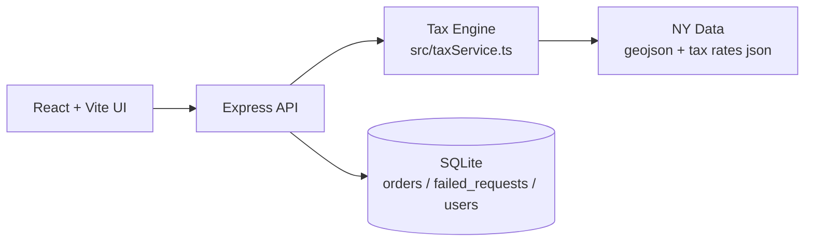

# BetterMe Tax Dashboard
Адмін-панель для сервісу **Instant Wellness Kits** з розрахунком New York sales tax за координатами доставки.  
Проєкт поєднує **Vite + React** (UI) та **Express + SQLite** (API + storage) і фокусується на податковому compliance для замовлень, створених вручну або через CSV.

## Live Demo
https://two-3unemployed.onrender.com/

## Що вміє адмінка
- JWT auth (login + перевірка сесії)
- Manual order creation (`latitude`, `longitude`, `subtotal`, `timestamp?`)
- CSV import замовлень
- Таблиця замовлень з pagination, сортуванням за `timestamp DESC` і агрегованою статистикою
- Лог помилкових/відхилених запитів (`failed_requests`)

## Постановка задачі хакатону
Сюжет: доставка wellness kits здійснюється дроном, тому ключовий атрибут локації — **GPS-координати**, а не текстова адреса.

Вхідні дані для розрахунку:
- `latitude`
- `longitude` (точка в межах NY)
- `subtotal`
- `timestamp` (опційно; якщо не передано — береться поточний час)

Очікуваний вихід:
- `composite_tax_rate`
- `tax_amount`
- `total_amount`
- `breakdown`: `state_rate`, `county_rate`, `city_rate`, `special_rates[]`
- `jurisdictions[]`

Ключові API для сценарію ТЗ:
- `POST /api/orders/import`
- `POST /api/orders`
- `GET /api/orders`

## Як ми це вирішили (Задача → Рішення)
| Задача | Рішення в проєкті |
|---|---|
| Перевірити, що точка належить NY | `isWithinNY(lat, lon)` через polygon lookup по `ny-counties.geojson` |
| Визначити county/locality за координатами | `findCounty` + place lookup у `src/taxService.ts` на базі `ny-counties.geojson` і `ny-places.geojson` |
| Порахувати composite tax з breakdown | `calculateNYTax` бере state/county/locality rates з `tax-rates.generated.json`, додає `special_rates` (MCTD за county), рахує `tax_amount`/`total_amount` з округленням до 2 знаків |
| Обробити special rates | `breakdown.special_rates` як масив об’єктів `{ name, rate }` (зараз використовується `MCTD`, коли застосовується) |
| Масовий імпорт CSV | `POST /api/orders/import` з `multer` + `csv-parse`; невалідні рядки не валять імпорт цілком |
| Логувати помилки | Невалідні/поза NY записи пишуться в `failed_requests` із `reason` і `source` |
| Manual create order | `POST /api/orders` з валідацією required полів і географії |
| Список замовлень | `GET /api/orders?page&limit` + `ORDER BY timestamp DESC` + `stats` (`total_revenue`, `total_tax`, `count`) |
| Авторизація | JWT middleware + `POST /api/auth/login`, `GET /api/auth/me` |
| Offline-ready дані | Згенеровані artifacts у `src/data/ny/*` закомічені; є скрипти оновлення в `scripts/*` |

### Реальні edge cases, які вже обробляються
- Координати поза NY: запис у `failed_requests`, API повертає 400.
- `longitude > 0` при CSV import: є автокорекція до `-longitude`, якщо після цього точка потрапляє в NY.
- `longitude > 0` при manual create: API повертає підказку `Did you mean longitude -X?`.
- Некоректні числа в CSV (`NaN`): рядок пропускається і логується в `failed_requests`.
- Legacy rows у БД: міграція заповнює `special_rates`/`special_rate_total` з історичного `special_rate`.

## Архітектура
React UI звертається до Express API. API виконує auth, валідацію координат, розрахунок tax через Tax Engine, зберігає результат у SQLite і повертає агреговані дані для dashboard.



Ключові файли/папки:
- `server.ts`
- `src/taxService.ts`
- `src/db.ts`
- `src/data/ny/*`
- `scripts/*`

## API документація
### Endpoints
- `GET /healthz`
- `GET /api/healthz`
- `GET /test-alive`
- `POST /api/auth/login`
- `GET /api/auth/me`
- `POST /api/orders`
- `POST /api/orders/import`
- `GET /api/orders?page=1&limit=10`
- `GET /api/failed-requests`
- `DELETE /api/history`

### Приклади curl
#### 1) Login (отримати token)
```bash
curl -sS -X POST http://localhost:3000/api/auth/login \
  -H "Content-Type: application/json" \
  -d '{"username":"admin","password":"SecureAdmin2026!"}'
```

#### 2) Create order
```bash
curl -sS -X POST http://localhost:3000/api/orders \
  -H "Content-Type: application/json" \
  -H "Authorization: Bearer <TOKEN>" \
  -d '{"latitude":40.7128,"longitude":-74.0060,"subtotal":49.99,"timestamp":"2026-02-28T12:00:00Z"}'
```

#### 3) Import CSV
```bash
curl -sS -X POST http://localhost:3000/api/orders/import \
  -H "Authorization: Bearer <TOKEN>" \
  -F "file=@./orders.csv"
```

#### 4) List orders (page/limit)
```bash
curl -sS "http://localhost:3000/api/orders?page=1&limit=10" \
  -H "Authorization: Bearer <TOKEN>"
```

### Скорочений приклад response
```json
{
  "data": [
    {
      "id": 1,
      "subtotal": 49.99,
      "composite_tax_rate": 0.08875,
      "tax_amount": 4.44,
      "total_amount": 54.43,
      "jurisdictions": ["New York State", "New York County", "MCTD"],
      "breakdown": {
        "state_rate": 0.04,
        "county_rate": 0.045,
        "city_rate": 0,
        "special_rates": [{ "name": "MCTD", "rate": 0.00375 }]
      }
    }
  ],
  "stats": {
    "total_revenue": 49.99,
    "total_tax": 4.44,
    "count": 1
  },
  "pagination": {
    "page": 1,
    "limit": 10,
    "total": 1,
    "pages": 1
  }
}
```

## Локальний запуск
1. `npm install`
2. `npm run dev`
3. Відкрити `http://localhost:3000`

`.env.example` містить базові змінні:
- `VITE_API_URL` — base URL backend для frontend запитів (порожньо для same-origin локально)
- `VITE_BASE_PATH` — base path для frontend (наприклад `/` або GitHub Pages path)
- `NY_STATE_RATE`, `MCTD_RATE` — довідкові значення в `.env.example` (розрахунок у коді йде з generated dataset)
- `PORT` та `NODE_ENV` підтримуються сервером (`PORT` читається в `server.ts`, `NODE_ENV` впливає на режим Vite middleware/static)

Default credentials:
- `username: admin`
- `password: SecureAdmin2026!`

## Джерела даних / як оновити
Дані ставок і геометрії формуються скриптами, але згенеровані файли вже в репозиторії (offline-ready).

Джерела:
- Publication 718 (NYS): `scripts/update_ny_tax_rates.ts`
- TIGERweb counties/places: `scripts/update_ny_geodata.ts`

Команди:
- `npm run update:ny:rates`
- `npm run update:ny:geo`
- `npm run update:ny:data`
- `npm run smoke:tax`

Artifacts:
- `src/data/ny/tax-rates.generated.json`
- `src/data/ny/ny-counties.geojson`
- `src/data/ny/ny-places.geojson`

## Обмеження та що покращити
1. Polygon lookup зараз лінійний; для великих навантажень варто додати spatial index (R-tree/PostGIS).
2. Locality exceptions залежать від точності place polygons і назво-нормалізації; можливі граничні кейси.
3. У `GET /api/orders` реально є pagination і сортування за timestamp, але немає повноцінних server-side filters (planned).
4. `JWT_SECRET` зараз хардкоджений у `server.ts`; у production потрібно винести в ENV.
5. SQLite підходить для хакатону/малого трафіку; для масштабування краще перейти на managed DB.
6. Потрібні ширші automated tests (unit + integration + boundary geo tests).
7. Корисно додати CI checks для dataset refresh і smoke checks на PR.
8. Імпорт CSV можна розширити детальнішим report per-row (причина, corrected/not corrected).
